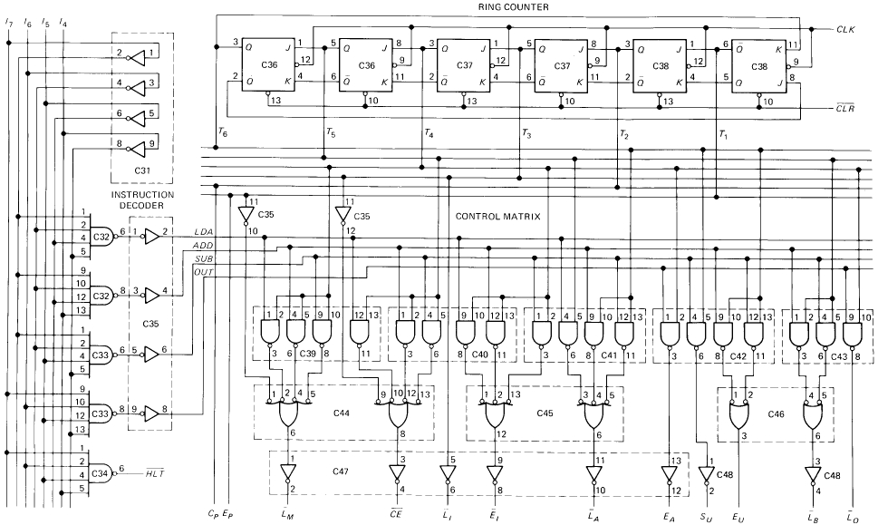

# Table of Contents

1.  [DESCRPTION :](#org1f9404a)
2.  [CONTROL WORD GENERATION](#orgfcdde60)
    1.  [Ring Counter](#orgd0d6b3e)
    2.  [Fetch Cycle](#org67c6423)
        1.  [Address State](#orgc39b1ef)
        2.  [Increment State](#orgd9ef86c)
        3.  [Memory State](#orgb6b375b)
    3.  [Execution Cycle](#org5cc400b)
3.  [LOGIC DIAGRAM :](#orgf64b748)
4.  [VERILOG CODE :](#org8b61765)
    1.  [Module :](#org7fd0418)
    2.  [Testbench](#orge3f4853)

# DESCRPTION :

Before each computer run, a CLRbar signal is sent to the program counter and a CLR signal to the instruction register. This resets the program counter to 0000 and wipes out the last instruction in the instruction register.

A clock signal CLK is sent to all buffer registers; this synchronizes the operation of the computer, ensuring that things happen when they are supposed to happen. In other words, all register transfers occur on the positive edge of a common CLK signal. Notice that a CLKsignal also goes to the program counter.

The 12 bits that come out of the controllers-sequencer form a word controlling the rest of the computer (like a supervisor telling others what to do.)The 12 wires carrying the control word are called the control bus.
The control word has the format of
CON = CP, EP, LMbar, CEbar
      LIbar, EIbar, LAbar, EA
      SU, EU, LBbar, LObar
Here I have split the 3 nibbles onto different lines. This word determines how the registers will react to the next positive CLK edge. For instance, a high EP and a low LMbar mean that the contents of the program counter are latched into the MAR on the next positive clock edge. As another example, a low CEbar and a low LAbar mean that the addressed RAM word will be transferred to the accumulator on the next positive clock edge.

# CONTROL WORD GENERATION

The control unit generated the control words that fetch and execute each instruction. To perform this the processor passes through different timing states (T states), periods during which the register contents change.

## Ring Counter

The SAP-1 has a component called the ring counter that generates the T states. Over successive clock pulses the ring word rotates through
                        T = 000001
                        T = 000010
                        T = 000100
                        T = 001000
                        T = 010000
                        T = 100000
Returning to T = 000001, and the cycle repeats. Each ring word represents one T state. The ring counter produces six T states. Each instruction is fetech and executed during these six T states.

## Fetch Cycle

Timing states T1, T2 and T3 make up the fetch cycle and are named Address, Increment and Memory State respectively.

### Address State

The T1 state is called the address state because the address in the program counter (PC) is transferred to the memory address register (MAR) during this state. During the address state, EP and LMbar are active; all other control bits are inactive. This means the controller-sequencer is sending out a control word of
CON = CP EP LMbar CEbar LIbar EIbar LAbar EA SU EU LBbar LObar
    =  0   1    0       1       1      1       1      0   0   0    1       1
during this state.

### Increment State

The T2 state is called the increment state, called this because the program counter is incremented. During the increment state the controller-sequencer produces the control word
CON = CP EP LMbar CEbar LIbar EIbar LAbar EA SU EU LBbar LObar
    =  1   0    1       1       1      1       1      0   0   0    1       1
As you see, the CP bit is active.

### Memory State

The T3 state is called the memory state because the addressed RAM instruction is transferred from the memory to the instruction register. The only active control bits during this state are CEbar and LIbar, the control word is then
CON = CP EP LMbar CEbar LIbar EIbar LAbar EA SU EU LBbar LObar
    =  0   0    1       0       0      1       1      0   0   0    1       1

## Execution Cycle

The next three timing states (T4, T5, T6) are the execution cycle of SAP-1. The control word produced during each of these states depends on the instruction being executed. The microinstructions of the processor are the control words produced at each T state. The macroinstructions are the ones used to the program the processor (LDA, ADD, SUB, OUT)

<!-- This HTML table template is generated by emacs 28.2 -->
<table border="1">
  <tr>
    <td align="left" valign="top">
      &nbsp;Macro&nbsp;
    </td>
    <td align="left" valign="top">
      &nbsp;State&nbsp;
    </td>
    <td align="left" valign="top">
      &nbsp;&nbsp;CON&nbsp;&nbsp;&nbsp;
    </td>
    <td align="left" valign="top">
      &nbsp;&nbsp;&nbsp;&nbsp;&nbsp;&nbsp;&nbsp;&nbsp;&nbsp;Active&nbsp;&nbsp;&nbsp;&nbsp;&nbsp;&nbsp;&nbsp;&nbsp;&nbsp;&nbsp;
    </td>
  </tr>
  <tr>
    <td rowspan="3" align="left" valign="top">
      &nbsp;&nbsp;&nbsp;&nbsp;&nbsp;&nbsp;&nbsp; 
      &nbsp;&nbsp;&nbsp;&nbsp;&nbsp;&nbsp;&nbsp; 
      &nbsp;&nbsp;LDA&nbsp;&nbsp; 
      &nbsp;&nbsp;&nbsp;&nbsp;&nbsp;&nbsp;&nbsp; 
      &nbsp;&nbsp;&nbsp;&nbsp;&nbsp;&nbsp;&nbsp;
    </td>
    <td align="left" valign="top">
      &nbsp;&nbsp;T_4&nbsp;&nbsp;
    </td>
    <td align="left" valign="top">
      &nbsp;0x1A3&nbsp;&nbsp;
    </td>
    <td align="left" valign="top">
      &nbsp;L_M_bar,&nbsp;E_I_bar&nbsp;&nbsp;&nbsp;&nbsp;&nbsp;&nbsp;&nbsp;&nbsp;
    </td>
  </tr>
  <tr>
    <td align="left" valign="top">
      &nbsp;&nbsp;T_5&nbsp;&nbsp;
    </td>
    <td align="left" valign="top">
      &nbsp;0x2C3&nbsp;&nbsp;
    </td>
    <td align="left" valign="top">
      &nbsp;CE_bar,&nbsp;L_A_bar&nbsp;&nbsp;&nbsp;&nbsp;&nbsp;&nbsp;&nbsp;&nbsp;&nbsp;
    </td>
  </tr>
  <tr>
    <td align="left" valign="top">
      &nbsp;&nbsp;T_6&nbsp;&nbsp;
    </td>
    <td align="left" valign="top">
      &nbsp;0x3E3&nbsp;&nbsp;
    </td>
    <td align="left" valign="top">
      &nbsp;NONE&nbsp;&nbsp;&nbsp;&nbsp;&nbsp;&nbsp;&nbsp;&nbsp;&nbsp;&nbsp;&nbsp;&nbsp;&nbsp;&nbsp;&nbsp;&nbsp;&nbsp;&nbsp;&nbsp;&nbsp;
    </td>
  </tr>
  <tr>
    <td rowspan="3" align="left" valign="top">
      &nbsp;&nbsp;&nbsp;&nbsp;&nbsp;&nbsp;&nbsp; 
      &nbsp;&nbsp;&nbsp;&nbsp;&nbsp;&nbsp;&nbsp; 
      &nbsp;&nbsp;ADD&nbsp;&nbsp; 
      &nbsp;&nbsp;&nbsp;&nbsp;&nbsp;&nbsp;&nbsp; 
      &nbsp;&nbsp;&nbsp;&nbsp;&nbsp;&nbsp;&nbsp;
    </td>
    <td align="left" valign="top">
      &nbsp;&nbsp;T_4&nbsp;&nbsp;
    </td>
    <td align="left" valign="top">
      &nbsp;0x1A3&nbsp;&nbsp;
    </td>
    <td align="left" valign="top">
      &nbsp;L_M_bar,&nbsp;E_I_bar&nbsp;&nbsp;&nbsp;&nbsp;&nbsp;&nbsp;&nbsp;&nbsp;
    </td>
  </tr>
  <tr>
    <td align="left" valign="top">
      &nbsp;&nbsp;T_5&nbsp;&nbsp;
    </td>
    <td align="left" valign="top">
      &nbsp;0x2E1&nbsp;&nbsp;
    </td>
    <td align="left" valign="top">
      &nbsp;CE_bar,&nbsp;L_B_bar&nbsp;&nbsp;&nbsp;&nbsp;&nbsp;&nbsp;&nbsp;&nbsp;&nbsp;
    </td>
  </tr>
  <tr>
    <td align="left" valign="top">
      &nbsp;&nbsp;T_6&nbsp;&nbsp;
    </td>
    <td align="left" valign="top">
      &nbsp;0x3C7&nbsp;&nbsp;
    </td>
    <td align="left" valign="top">
      &nbsp;L_A_bar,&nbsp;E_U&nbsp;&nbsp;&nbsp;&nbsp;&nbsp;&nbsp;&nbsp;&nbsp;&nbsp;&nbsp;&nbsp;&nbsp;
    </td>
  </tr>
  <tr>
    <td rowspan="3" align="left" valign="top">
      &nbsp;&nbsp;&nbsp;&nbsp;&nbsp;&nbsp;&nbsp; 
      &nbsp;&nbsp;&nbsp;&nbsp;&nbsp;&nbsp;&nbsp; 
      &nbsp;&nbsp;SUB&nbsp;&nbsp; 
      &nbsp;&nbsp;&nbsp;&nbsp;&nbsp;&nbsp;&nbsp; 
      &nbsp;&nbsp;&nbsp;&nbsp;&nbsp;&nbsp;&nbsp;
    </td>
    <td align="left" valign="top">
      &nbsp;&nbsp;T_4&nbsp;&nbsp;
    </td>
    <td align="left" valign="top">
      &nbsp;0x1A3&nbsp;&nbsp;
    </td>
    <td align="left" valign="top">
      &nbsp;L_M_bar,&nbsp;E_I_bar&nbsp;&nbsp;&nbsp;&nbsp;&nbsp;&nbsp;&nbsp;&nbsp;
    </td>
  </tr>
  <tr>
    <td align="left" valign="top">
      &nbsp;&nbsp;T_5&nbsp;&nbsp;
    </td>
    <td align="left" valign="top">
      &nbsp;0x2E1&nbsp;&nbsp;
    </td>
    <td align="left" valign="top">
      &nbsp;CE_bar,&nbsp;L_B_bar&nbsp;&nbsp;&nbsp;&nbsp;&nbsp;&nbsp;&nbsp;&nbsp;&nbsp;
    </td>
  </tr>
  <tr>
    <td align="left" valign="top">
      &nbsp;&nbsp;T_6&nbsp;&nbsp;
    </td>
    <td align="left" valign="top">
      &nbsp;0x3CF&nbsp;&nbsp;
    </td>
    <td align="left" valign="top">
      &nbsp;L_A_bar,&nbsp;S_U,&nbsp;E_U&nbsp;&nbsp;&nbsp;&nbsp;&nbsp;&nbsp;&nbsp;
    </td>
  </tr>
  <tr>
    <td rowspan="3" align="left" valign="top">
      &nbsp;&nbsp;&nbsp;&nbsp;&nbsp;&nbsp;&nbsp; 
      &nbsp;&nbsp;&nbsp;&nbsp;&nbsp;&nbsp;&nbsp; 
      &nbsp;&nbsp;OUT&nbsp;&nbsp; 
      &nbsp;&nbsp;&nbsp;&nbsp;&nbsp;&nbsp;&nbsp; 
      &nbsp;&nbsp;&nbsp;&nbsp;&nbsp;&nbsp;&nbsp;
    </td>
    <td align="left" valign="top">
      &nbsp;&nbsp;T_4&nbsp;&nbsp;
    </td>
    <td align="left" valign="top">
      &nbsp;0x3F2&nbsp;&nbsp;
    </td>
    <td align="left" valign="top">
      &nbsp;E_A,&nbsp;L_O_bar&nbsp;&nbsp;&nbsp;&nbsp;&nbsp;&nbsp;&nbsp;&nbsp;&nbsp;&nbsp;&nbsp;&nbsp;
    </td>
  </tr>
  <tr>
    <td align="left" valign="top">
      &nbsp;&nbsp;T_5&nbsp;&nbsp;
    </td>
    <td align="left" valign="top">
      &nbsp;0x3E3&nbsp;&nbsp;
    </td>
    <td align="left" valign="top">
      &nbsp;NONE&nbsp;&nbsp;&nbsp;&nbsp;&nbsp;&nbsp;&nbsp;&nbsp;&nbsp;&nbsp;&nbsp;&nbsp;&nbsp;&nbsp;&nbsp;&nbsp;&nbsp;&nbsp;&nbsp;&nbsp;
    </td>
  </tr>
  <tr>
    <td align="left" valign="top">
      &nbsp;&nbsp;T_6&nbsp;&nbsp;
    </td>
    <td align="left" valign="top">
      &nbsp;0x3E3&nbsp;&nbsp;
    </td>
    <td align="left" valign="top">
      &nbsp;NONE&nbsp;&nbsp;&nbsp;&nbsp;&nbsp;&nbsp;&nbsp;&nbsp;&nbsp;&nbsp;&nbsp;&nbsp;&nbsp;&nbsp;&nbsp;&nbsp;&nbsp;&nbsp;&nbsp;&nbsp;
    </td>
  </tr>
</table>

# LOGIC DIAGRAM :

# VERILOG CODE :

## Module :

    `ifndef SN74LS107
       `define SN74LS107
       `include "7400/SN74LS107/SN74LS107.v"
    `endif
    module Controller_Sequencer(instruction, CLK, CLR_bar, C_P, E_P, L_M_bar, CE_bar, L_I_bar, E_I_bar, L_A_bar, E_A, S_U, E_U, L_B_bar, L_O_bar, HLT_bar);
       input [7:4] instruction;
       input CLK;
       input CLR_bar;
       output C_P, E_P, L_M_bar, CE_bar, L_I_bar, E_I_bar, L_A_bar, E_A, S_U, E_U, L_B_bar, L_O_bar;
       output HLT_bar;
    
       wire [7:4] not_instruction = ~instruction;
    
       // Instruction Decoder
       wire LDA = (not_instruction[7] & not_instruction[6] & not_instruction[5] & not_instruction[4]);
       wire ADD = (not_instruction[7] & not_instruction[6] & not_instruction[5] & instruction[4]);
       wire SUB = (not_instruction[7] & not_instruction[6] & instruction[5] & not_instruction[4]);
       wire OUT = (instruction[7] & instruction[6] & instruction[5] & not_instruction[4]);
       assign HLT_bar = ~(instruction[7] & instruction[6] & instruction[5] & instruction[4]);
    
       // Control Matrix
       wire [6:1] T;
       assign C_P = T[2];
       assign E_P = T[1];
       assign L_M_bar = ~|{T[1],LDA & T[4],ADD & T[4],SUB & T[4]};
       assign CE_bar = ~|{T[3],LDA & T[5],ADD & T[5],SUB & T[5]};
       assign L_I_bar = ~T[3];
       assign E_I_bar = ~|{LDA & T[4],ADD & T[4],SUB & T[4]};
       assign L_A_bar = ~|{LDA & T[5],ADD & T[6],SUB & T[6]};
       assign E_A = OUT & T[4];
       assign S_U = SUB & T[6];
       assign E_U = |{ADD & T[6], SUB & T[6]};
       assign L_B_bar = ~|{ADD & T[5],SUB & T[5]};
       assign L_O_bar = ~(OUT & T[4]);
    
       wire [6:1] Q;
       wire [6:1] Q_bar;
    
       assign T = {Q[6:2], Q_bar[1]};
    
       // Ring Counter
       SN74LS107 dualFF_1(.CLK_1(!CLK), .CLR_bar_1(CLR_bar), .J_1(Q_bar[6]), .K_1(Q[6]), .Q_1(Q[1]), .Q_bar_1(Q_bar[1]),
                          .CLK_2(!CLK), .CLR_bar_2(CLR_bar), .J_2(Q_bar[1]), .K_2(Q[1]), .Q_2(Q[2]), .Q_bar_2(Q_bar[2]));
       SN74LS107 dualFF_2(.CLK_1(!CLK), .CLR_bar_1(CLR_bar), .J_1(Q[2]), .K_1(Q_bar[2]), .Q_1(Q[3]), .Q_bar_1(Q_bar[3]),
                          .CLK_2(!CLK), .CLR_bar_2(CLR_bar), .J_2(Q[3]), .K_2(Q_bar[3]), .Q_2(Q[4]), .Q_bar_2(Q_bar[4]));
       SN74LS107 dualFF_3(.CLK_1(!CLK), .CLR_bar_1(CLR_bar), .J_1(Q[4]), .K_1(Q_bar[4]), .Q_1(Q[5]), .Q_bar_1(Q_bar[5]),
                          .CLK_2(!CLK), .CLR_bar_2(CLR_bar), .J_2(Q[5]), .K_2(Q_bar[5]), .Q_2(Q[6]), .Q_bar_2(Q_bar[6]));
    endmodule

## Testbench

    module Controller_Sequencer_tb;
       `ifdef Controller_Sequencer_test
       reg [7:4] instruction;
       reg CLK;
       reg CLR_bar;
       wire C_P, E_P, L_M_bar, CE_bar, L_I_bar, E_I_bar, L_A_bar, E_A, S_U, E_U, L_B_bar, L_O_bar;
       wire HLT_bar;
       integer k;
       reg [11:0] CON;
    
       Controller_Sequencer DUT(instruction, CLK, CLR_bar, C_P, E_P, L_M_bar, CE_bar, L_I_bar, E_I_bar, L_A_bar, E_A, S_U, E_U, L_B_bar, L_O_bar, HLT_bar);
    
    
       // Generate Clock Signals
       initial begin
          CLK = 0; #1;
          forever #1 CLK = ~CLK;
       end
       initial begin
          // Waveform generation
          $dumpfile("Controller_Sequencer_tb.vcd");
          $dumpvars(0, Controller_Sequencer_tb);
          // Clear the register
          CLR_bar = 1; #1;
          CLR_bar = 0; #1;
          CLR_bar = 1; #1;
    
          $display("Instruction : HLT");
          // Set an instruction HLT (1111)
          instruction = 4'b1111;
          for (k=0; k<6; k=k+1)
            begin
               CON = {C_P, E_P, L_M_bar, CE_bar, L_I_bar, E_I_bar, L_A_bar, E_A, S_U, E_U, L_B_bar, L_O_bar};
               case ((k%6)+1)
                  1 : $display("T%1d : Correct Control Bus  = %12b, Measured Control Bus = %4b, Agreement = %12b", (k%6)+1, 12'b010111100011, CON,  12'b010111100011 ^ CON);
                  2 : $display("T%1d : Correct Control Bus  = %12b, Measured Control Bus = %4b, Agreement = %12b", (k%6)+1, 12'b101111100011, CON, 12'b101111100011 ^ CON);
                  3 : $display("T%1d : Correct Control Bus  = %12b, Measured Control Bus = %4b, Agreement = %12b", (k%6)+1, 12'b001001100011, CON, 12'b001001100011 ^ CON);
                  4 : $display("T%1d : Correct Control Bus  = %12b, Measured Control Bus = %4b, Agreement = %12b", (k%6)+1, 12'h3E3, CON, 12'h3E3 ^ CON);
                  5 : $display("T%1d : Correct Control Bus  = %12b, Measured Control Bus = %4b, Agreement = %12b", (k%6)+1, 12'h3E3, CON, 12'h3E3 ^ CON);
                  6 : $display("T%1d : Correct Control Bus  = %12b, Measured Control Bus = %4b, Agreement = %12b", (k%6)+1, 12'h3E3, CON, 12'h3E3 ^ CON);
                  default: $display("Execution State");
               endcase
             #2;
            end
    
          $display("Instruction : LDA");
          // Set an instruction LDA (0000)
          instruction = 4'b0000;
          for (k=0; k<6; k=k+1)
            begin
               CON = {C_P, E_P, L_M_bar, CE_bar, L_I_bar, E_I_bar, L_A_bar, E_A, S_U, E_U, L_B_bar, L_O_bar};
               case ((k%6)+1)
                  1 : $display("T%1d : Correct Control Bus  = %12b, Measured Control Bus = %4b, Agreement = %12b", (k%6)+1, 12'b010111100011, CON,  12'b010111100011 ^ CON);
                  2 : $display("T%1d : Correct Control Bus  = %12b, Measured Control Bus = %4b, Agreement = %12b", (k%6)+1, 12'b101111100011, CON, 12'b101111100011 ^ CON);
                  3 : $display("T%1d : Correct Control Bus  = %12b, Measured Control Bus = %4b, Agreement = %12b", (k%6)+1, 12'b001001100011, CON, 12'b001001100011 ^ CON);
                  4 : $display("T%1d : Correct Control Bus  = %12b, Measured Control Bus = %4b, Agreement = %12b", (k%6)+1, 12'h1A3, CON, 12'h1A3 ^ CON);
                  5 : $display("T%1d : Correct Control Bus  = %12b, Measured Control Bus = %4b, Agreement = %12b", (k%6)+1, 12'h2C3, CON, 12'h2C3 ^ CON);
                  6 : $display("T%1d : Correct Control Bus  = %12b, Measured Control Bus = %4b, Agreement = %12b", (k%6)+1, 12'h3E3, CON, 12'h3E3 ^ CON);
                  default: $display("Execution State");
               endcase
             #2;
            end
    
          $display("Instruction : ADD");
          // Set an instruction ADD (0001)
          instruction = 4'b0001;
          for (k=0; k<6; k=k+1)
            begin
               CON = {C_P, E_P, L_M_bar, CE_bar, L_I_bar, E_I_bar, L_A_bar, E_A, S_U, E_U, L_B_bar, L_O_bar};
               case ((k%6)+1)
                  1 : $display("T%1d : Correct Control Bus  = %12b, Measured Control Bus = %4b, Agreement = %12b", (k%6)+1, 12'b010111100011, CON,  12'b010111100011  ^  CON);
                  2 : $display("T%1d : Correct Control Bus  = %12b, Measured Control Bus = %4b, Agreement = %12b", (k%6)+1, 12'b101111100011, CON, 12'b101111100011  ^  CON);
                  3 : $display("T%1d : Correct Control Bus  = %12b, Measured Control Bus = %4b, Agreement = %12b", (k%6)+1, 12'b001001100011, CON, 12'b001001100011  ^  CON);
                  4 : $display("T%1d : Correct Control Bus  = %12b, Measured Control Bus = %4b, Agreement = %12b", (k%6)+1, 12'h1A3, CON, 12'h1A3  ^  CON);
                  5 : $display("T%1d : Correct Control Bus  = %12b, Measured Control Bus = %4b, Agreement = %12b", (k%6)+1, 12'h2E1, CON, 12'h2E1  ^  CON);
                  6 : $display("T%1d : Correct Control Bus  = %12b, Measured Control Bus = %4b, Agreement = %12b", (k%6)+1, 12'h3C7, CON, 12'h3C7  ^  CON);
                  default: $display("Execution State");
               endcase
             #2;
            end
    
          $display("Instruction : SUB");
          // Set an instruction SUB (0010)
          instruction = 4'b0010;
          for (k=0; k<6; k=k+1)
            begin
               CON = {C_P, E_P, L_M_bar, CE_bar, L_I_bar, E_I_bar, L_A_bar, E_A, S_U, E_U, L_B_bar, L_O_bar};
               case ((k%6)+1)
                  1 : $display("T%1d : Correct Control Bus  = %12b, Measured Control Bus = %4b, Agreement = %12b", (k%6)+1, 12'b010111100011, CON,  12'b010111100011 ^ CON);
                  2 : $display("T%1d : Correct Control Bus  = %12b, Measured Control Bus = %4b, Agreement = %12b", (k%6)+1, 12'b101111100011, CON, 12'b101111100011 ^ CON);
                  3 : $display("T%1d : Correct Control Bus  = %12b, Measured Control Bus = %4b, Agreement = %12b", (k%6)+1, 12'b001001100011, CON, 12'b001001100011 ^ CON);
                  4 : $display("T%1d : Correct Control Bus  = %12b, Measured Control Bus = %4b, Agreement = %12b", (k%6)+1, 12'h1A3, CON, 12'h1A3 ^ CON);
                  5 : $display("T%1d : Correct Control Bus  = %12b, Measured Control Bus = %4b, Agreement = %12b", (k%6)+1, 12'h2E1, CON, 12'h2E1 ^ CON);
                  6 : $display("T%1d : Correct Control Bus  = %12b, Measured Control Bus = %4b, Agreement = %12b", (k%6)+1, 12'h3CF, CON, 12'h3CF ^ CON);
                  default: $display("Execution State");
               endcase
             #2;
            end
    
          $display("Instruction : OUT");
          // Set an instruction OUT (1110)
          instruction = 4'b1110;
          for (k=0; k<6; k=k+1)
            begin
               CON = {C_P, E_P, L_M_bar, CE_bar, L_I_bar, E_I_bar, L_A_bar, E_A, S_U, E_U, L_B_bar, L_O_bar};
               case ((k%6)+1)
                  1 : $display("T%1d : Correct Control Bus  = %12b, Measured Control Bus = %4b, Agreement = %12b", (k%6)+1, 12'b010111100011, CON,  12'b010111100011 ^ CON);
                  2 : $display("T%1d : Correct Control Bus  = %12b, Measured Control Bus = %4b, Agreement = %12b", (k%6)+1, 12'b101111100011, CON, 12'b101111100011 ^ CON);
                  3 : $display("T%1d : Correct Control Bus  = %12b, Measured Control Bus = %4b, Agreement = %12b", (k%6)+1, 12'b001001100011, CON, 12'b001001100011 ^ CON);
                  4 : $display("T%1d : Correct Control Bus  = %12b, Measured Control Bus = %4b, Agreement = %12b", (k%6)+1, 12'h3F2, CON, 12'h3F2 ^ CON);
                  5 : $display("T%1d : Correct Control Bus  = %12b, Measured Control Bus = %4b, Agreement = %12b", (k%6)+1, 12'h3E3, CON, 12'h3E3 ^ CON);
                  6 : $display("T%1d : Correct Control Bus  = %12b, Measured Control Bus = %4b, Agreement = %12b", (k%6)+1, 12'h3E3, CON, 12'h3E3 ^ CON);
                  default: $display("Execution State");
               endcase
             #2;
            end
          $finish;
       end
       `endif
    endmodule

